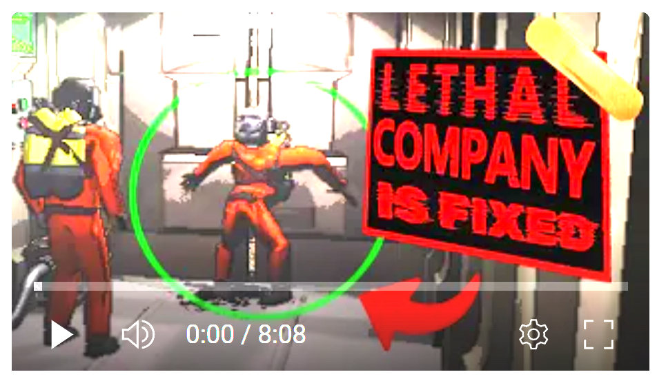

# Lethal Doors
Transforms the hangar doors into a hazardous obstacle or helpful tool when your team is low on scrap on the last day! 

#### Watch this super cool video on the Mod that I worked hard on & would like you to watch :) 
 

## How it Works
- Lethal Hangar Doors: **Shortly after the ship lands,** the hangar doors become deadly. If players are within a dangerous threshold of the door while closing they are either severely injury or terminated.
- Tracks the players affected in each door open/close cycle to ensure damage is applied correctly and fairly.
- Door will not impact player until seconds after the ship lands. This "feature" is considered the safe zone period. Once ship lands it will be lethal. 
- **Requirements**: Both Host & Clients Require Installing the Mod.

## Versions & Notes
Leave any comments for improvements or bugs on the github repo!
- 1.0.1 ✅ Initial Release - Seeking helping getting this to work fully server side if possible. New to unity over here :)
- 1.0.2 ✅ Readme updates
- 1.0.3 ✅ Door can now kill enemies on map. Try luring the Eyeless dog or even masked enemies with caution... 
- 1.0.4 🛠️ In-progress: Doors within dungons to also be lethal to players & enemies + fixes for v49. Also added a super cool video/devlog